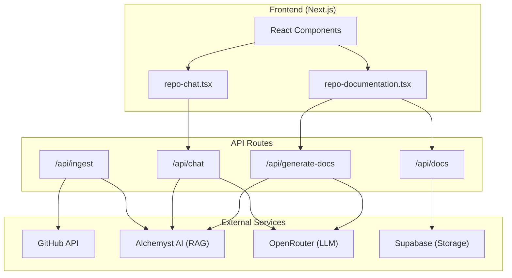

# 🧪 GitAlchemy

<p align="center">
  <strong>Transform code into knowledge with AI</strong>
</p>

<p align="center">
  <em>An intelligent codebase explorer that helps you understand any GitHub repository through AI-powered chat and auto-generated documentation.</em>
</p>

---

## ✨ Features

### 🔍 **AI-Powered Code Chat**
Ask questions about any codebase and get intelligent, context-aware answers. GitAlchemy uses RAG (Retrieval-Augmented Generation) with multi-pass semantic search to find relevant code and provide accurate explanations with source citations.

### 📚 **Auto-Generated Documentation**
Automatically generate comprehensive documentation for any repository, including:
- **Introduction** - High-level overview with architecture diagrams
- **Quick Start** - Get up and running quickly
- **Architecture** - Detailed codebase structure with Mermaid flowcharts

### 🔐 **Private Repository Support**
Access your private repositories by adding your GitHub Personal Access Token in Settings. Your token is stored securely in your browser's localStorage and is only sent to the ingestion API when needed.

### 🚀 **Smart Repository Ingestion**
Simply paste a GitHub URL or `owner/repo` format to instantly index and explore any repository. Supports multiple file types including TypeScript, JavaScript, Python, Go, Rust, Java, SQL, and more.

### 📊 **Visual Architecture Diagrams**
Automatically generated Mermaid flowcharts visualize your codebase structure, component relationships, and data flows.

### 🔗 **Shareable Documentation**
Generated documentation is persisted in Supabase, allowing you to share and access it anytime without re-generating.

### 💾 **Persistent Knowledge Base**
Ingested repositories are stored in the Alchemyst AI context, allowing you to return and continue exploring without re-indexing.

---

## 🛠️ Tech Stack

| Category | Technology |
|----------|------------|
| **Framework** | [Next.js 16](https://nextjs.org) (App Router) |
| **Language** | TypeScript |
| **Styling** | [Tailwind CSS 4](https://tailwindcss.com) |
| **UI Components** | [Radix UI](https://radix-ui.com) + [shadcn/ui](https://ui.shadcn.com) |
| **AI/RAG** | [Alchemyst AI SDK](https://alchemyst.ai) (`@alchemystai/sdk`) |
| **LLM** | [OpenRouter](https://openrouter.ai) (`xiaomi/mimo-v2-flash:free`) |
| **Database** | [Supabase](https://supabase.com) (PostgreSQL) |
| **Diagrams** | [Mermaid.js](https://mermaid.js.org) |
| **Markdown** | react-markdown, KaTeX, react-syntax-highlighter |
| **Package Manager** | Bun / npm |

---

## 🚀 Getting Started

### Prerequisites

- [Node.js](https://nodejs.org) 18+ or [Bun](https://bun.sh)
- A GitHub Personal Access Token (for API access)
- An [Alchemyst AI](https://alchemyst.ai) API key
- An [OpenRouter](https://openrouter.ai) API key
- A [Supabase](https://supabase.com) project

### Installation

1. **Clone the repository**
   ```bash
   git clone https://github.com/your-org/GitAlchemy.git
   cd GitAlchemy
   ```

2. **Install dependencies**
   ```bash
   bun install
   # or
   npm install
   ```

3. **Configure environment variables**
   
   Create a `.env` file in the root directory (see `.env.example`):
   ```env
   GITHUB_TOKEN=your_github_personal_access_token
   ALCHEMYST_AI_API_KEY=your_alchemyst_api_key
   OPENROUTER_API_KEY=your_openrouter_api_key
   NEXT_PUBLIC_SUPABASE_URL=https://xxxxx.supabase.co
   SUPABASE_SERVICE_KEY=your_supabase_service_role_key
   ```

4. **Set up Supabase**
   
   Create a `documentation` table in your Supabase project:
   ```sql
   CREATE TABLE documentation (
     id UUID DEFAULT gen_random_uuid() PRIMARY KEY,
     owner TEXT NOT NULL,
     repo TEXT NOT NULL,
     section TEXT NOT NULL,
     content TEXT,
     sources TEXT[] DEFAULT '{}',
     created_at TIMESTAMPTZ DEFAULT NOW(),
     updated_at TIMESTAMPTZ DEFAULT NOW(),
     UNIQUE(owner, repo, section)
   );
   ```

5. **Run the development server**
   ```bash
   bun dev
   # or
   npm run dev
   ```

6. **Open your browser**
   
   Navigate to [http://localhost:3000](http://localhost:3000)

---

## 📖 Usage

### Exploring a Repository

1. **Enter a repo URL** - On the home page, paste a GitHub URL (e.g., `https://github.com/vercel/next.js`) or use the shorthand format (`vercel/next.js`).

2. **Wait for ingestion** - GitAlchemy will fetch and index the repository's code files (up to 100 files).

3. **Browse documentation** - View auto-generated documentation sections for the repository.

4. **Chat with the codebase** - Ask questions like:
   - *"How does the routing system work?"*
   - *"What design patterns are used in this project?"*
   - *"Explain the authentication flow"*
   - *"Show me the main exported functions"*

### Private Repositories

1. Click the **Settings** icon in the top-right corner
2. Enter your GitHub Personal Access Token
3. Your token is stored locally and used for private repo access

### Supported File Types

GitAlchemy indexes the following file types:
- **Code**: `.ts`, `.tsx`, `.js`, `.jsx`, `.py`, `.go`, `.java`, `.rs`, `.c`, `.cpp`, `.h`, `.sql`
- **Config**: `.json`, `.yml`, `.yaml`, `.prisma`, `.env.example`
- **Docs**: `.md`, `.mdx`

---

## 📁 Project Structure

```
GitAlchemy/
├── src/
│   ├── app/
│   │   ├── api/
│   │   │   ├── chat/              # AI chat endpoint (RAG + LLM)
│   │   │   ├── docs/              # Documentation CRUD endpoint
│   │   │   ├── generate-docs/     # Doc generation with Mermaid diagrams
│   │   │   └── ingest/            # GitHub repo ingestion
│   │   ├── [owner]/[repo]/        # Dynamic repo pages
│   │   ├── globals.css            # Global styles
│   │   ├── layout.tsx             # Root layout with theme provider
│   │   └── page.tsx               # Home page
│   ├── components/
│   │   ├── ui/                    # shadcn/ui components
│   │   ├── chat-input-bar.tsx     # Chat input component
│   │   ├── hero-section.tsx       # Landing page hero
│   │   ├── markdown-render.tsx    # Markdown + Mermaid + KaTeX renderer
│   │   ├── repo-card.tsx          # Repository card component
│   │   ├── repo-chat.tsx          # Full chat interface
│   │   ├── repo-documentation.tsx # Documentation viewer/generator
│   │   └── settings-dialog.tsx    # GitHub token settings
│   └── lib/
│       ├── alchemyst.ts           # Alchemyst AI client (lazy-init)
│       ├── docs-storage.ts        # Supabase docs CRUD operations
│       ├── supabase.ts            # Supabase client (lazy-init)
│       ├── theme-provider.tsx     # next-themes provider
│       └── utils.ts               # Utility functions (cn)
├── public/                        # Static assets
├── .env.example                   # Environment template
├── components.json                # shadcn/ui config
├── Dockerfile                     # Docker containerization
├── docker-compose.yml             # Docker compose config
├── package.json
├── tsconfig.json
└── README.md
```

---

## 🔧 Configuration

### Environment Variables

| Variable | Description | Required |
|----------|-------------|----------|
| `GITHUB_TOKEN` | GitHub Personal Access Token for API requests | ✅ Yes |
| `ALCHEMYST_AI_API_KEY` | Alchemyst AI API key for RAG functionality | ✅ Yes |
| `OPENROUTER_API_KEY` | OpenRouter API key for LLM access | ✅ Yes |
| `NEXT_PUBLIC_SUPABASE_URL` | Supabase project URL (public) | ✅ Yes |
| `SUPABASE_SERVICE_KEY` | Supabase service role key (server-side) | ✅ Yes |

### Getting API Keys

1. **GitHub Token**: [Create a Personal Access Token](https://github.com/settings/tokens) with `repo` scope
2. **Alchemyst AI**: Sign up at [alchemyst.ai](https://alchemyst.ai) to get your API key
3. **OpenRouter**: Create an account at [openrouter.ai](https://openrouter.ai) for LLM access
4. **Supabase**: Create a project at [supabase.com](https://supabase.com) and get your keys from Project Settings → API

---

## 🐳 Docker

Run with Docker:

```bash
docker-compose up --build
```

Or build manually:

```bash
docker build -t git-alchemy .
docker run -p 3000:3000 --env-file .env git-alchemy
```

---

## 🏗️ Architecture



---

## 🤝 Contributing

Contributions are welcome! Please feel free to submit a Pull Request.

1. Fork the repository
2. Create your feature branch (`git checkout -b feature/amazing-feature`)
3. Commit your changes (`git commit -m 'Add some amazing feature'`)
4. Push to the branch (`git push origin feature/amazing-feature`)
5. Open a Pull Request

---

## 📄 License

This project is open source and available under the [MIT License](LICENSE).

---

## 🙏 Acknowledgments

- [Alchemyst AI](https://alchemyst.ai) - For the powerful RAG SDK
- [OpenRouter](https://openrouter.ai) - For LLM access
- [shadcn/ui](https://ui.shadcn.com) - For beautiful UI components
- [Vercel](https://vercel.com) - For Next.js and hosting
- [Supabase](https://supabase.com) - For the database platform

---

<p align="center">
  Made with ❤️ by the Alchemyst AI team
</p>
